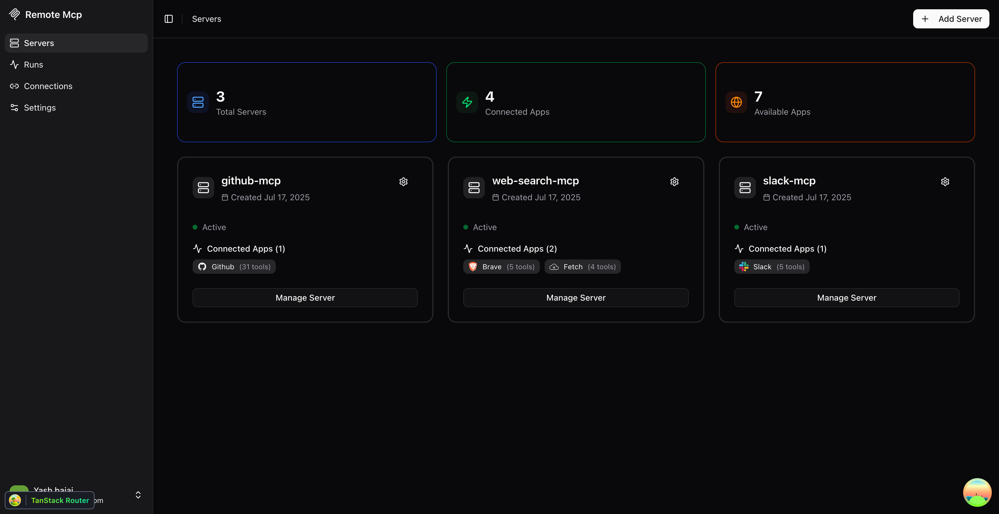

# Remote MCP 🚀

**Create and connect MCP servers to your favorite AI clients - no complex setup required!**

[🌐 Try Remote MCP](https://remotemcp.vercel.app) | [📖 What is MCP?](#what-is-mcp) | [🚀 Getting Started](#getting-started)

---

## What is Remote MCP?

Remote MCP is a cloud-based platform that lets you easily create and manage **Model Context Protocol (MCP) servers** and connect them to your favorite AI clients like Claude Desktop, Cursor, or any MCP-compatible application.

Think of it as a bridge between your AI assistant and the apps you use every day - GitHub, Slack, YouTube, PostgreSQL, and many more!



## What is MCP?

The **Model Context Protocol (MCP)** is an open standard that enables AI assistants to securely connect to external data sources and tools. Instead of just chatting, your AI can now:

- 📝 Create GitHub issues and pull requests
- 💬 Send Slack messages
- 🗄️ Query databases
- 🔍 Search the web
- 📺 Manage YouTube content
- And much more!

### How MCP Works

```
┌─────────────┐    ┌─────────────┐    ┌─────────────┐
│ AI Client   │────│ MCP Server  │────│   Your App  │
│ (Claude)    │    │ (Remote MCP)│    │ (GitHub)    │
└─────────────┘    └─────────────┘    └─────────────┘
```

1. **AI Client**: Your favorite AI assistant (Claude Desktop, Cursor, etc.)
2. **MCP Server**: Acts as a bridge (that's what Remote MCP provides!)
3. **Your App**: The service you want to connect (GitHub, Slack, etc.)

## Why Remote MCP?

### 🎯 **Simple Setup**

No need to run local servers or manage complex configurations. Just create, configure, and connect!

### 🔒 **Secure & Reliable**

Your credentials are encrypted and managed securely. We handle authentication, API limits, and security.

### 🌍 **Always Available**

Cloud-hosted servers that work 24/7, accessible from any MCP client.

### 📊 **Visual Management**

Easy-to-use dashboard to manage your servers, connections, and monitor usage.


## Available Apps

Remote MCP supports integration with popular apps including:

- **🐙 GitHub** - Manage repositories, issues, and pull requests (32 tools)
- **💬 Slack** - Send messages and manage channels (5 tools)
- **📺 YouTube** - Manage videos and playlists (27 tools)
- **🦊 GitLab** - Repository management (10 tools)
- **🐘 PostgreSQL** - Database queries and management (8 tools)
- **🔍 Brave Search** - Web search capabilities (5 tools)
- **📥 Fetch** - HTTP requests and data fetching (4 tools)

_And more apps are being added regularly!_

## Getting Started

### 1. Create Your MCP Server

1. Visit [remotemcp.vercel.app](https://remotemcp.vercel.app)
2. Sign up with Google or GitHub
3. Click "Add Server" to create your first MCP server
4. Choose the apps you want to connect (GitHub, Slack, etc.)

### 2. Configure App Connections

1. Go to the "Connections" tab
2. Click "New Connection"
3. Select your app and authenticate
4. Your credentials are securely stored and encrypted

### 3. Connect to Your AI Client

Add your Remote MCP server to your AI client:

**For VS Code & Cursor:**
Simply click the **"Add to VS Code"** or **"Add to Cursor"** button in your server dashboard - it automatically configures everything for you!

**For Claude Desktop:**
Add to your `claude_desktop_config.json`:

```json
{
  "mcpServers": {
    "remote-mcp": {
      "command": "npx",
      "args": [
        "@modelcontextprotocol/server-everything",
        "https://remotemcp.vercel.app/api/mcp/YOUR_SERVER_ID"
      ]
    }
  }
}
```

**For Other Clients:**
Use the MCP endpoint URL: `https://remotemcp.vercel.app/api/mcp/YOUR_SERVER_ID`

### 4. Start Using!

Your AI assistant can now interact with your connected apps. Try asking:

- "Create a GitHub issue for the bug I found"
- "Send a message to the #general Slack channel"
- "Search for recent videos about AI on YouTube"

<!-- ## Contributing

We welcome contributions! Check out our [contributing guidelines](CONTRIBUTING.md) to get started. -->

## License

This project is licensed under the MIT License - see the [MIT](LICENSE) file for details.

---

**Made with ❤️ for the AI community**

[Get Started](https://remotemcp.vercel.app)
