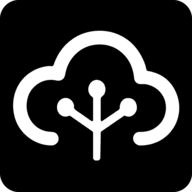

<div align="center">



# Remote MCP 🚀

**Create and connect MCP servers to your favorite AI clients - no complex setup required!**

</div>

[🌐 Try Remote MCP](https://remotemcp.tech) | [📖 What is MCP?](#what-is-mcp) | [🚀 Getting Started](#getting-started)

---


## What is Remote MCP?

Remote MCP is a cloud-based platform that lets you easily create and manage **Model Context Protocol (MCP) servers** and connect them to your favorite AI clients like Claude Desktop, Cursor, or any MCP-compatible application.

Think of it as a bridge between your AI assistant and the apps you use every day - GitHub, Slack, YouTube, PostgreSQL, and many more!


https://github.com/user-attachments/assets/3ddedf4e-571b-4e78-a46c-f15df8c4fe56


## What is MCP?

The **Model Context Protocol (MCP)** is an open standard that enables AI assistants to securely connect to external data sources and tools. Instead of just chatting, your AI can now:

- 📝 Create GitHub issues and pull requests
- 💬 Send Slack messages
- 🗄️ Query databases
- 🔍 Search the web
- 📺 Manage YouTube content
- And much more!

### How MCP Works

```
┌─────────────┐    ┌─────────────┐    ┌─────────────┐
│ AI Client   │────│ MCP Server  │────│   Your App  │
│ (Claude)    │    │ (Remote MCP)│    │ (GitHub)    │
└─────────────┘    └─────────────┘    └─────────────┘
```

1. **AI Client**: Your favorite AI assistant (Claude Desktop, Cursor, etc.)
2. **MCP Server**: Acts as a bridge (that's what Remote MCP provides!)
3. **Your App**: The service you want to connect (GitHub, Slack, etc.)

## Why Remote MCP?

### 🎯 **Simple Setup**

No need to run local servers or manage complex configurations. Just create, configure, and connect!

### 🔒 **Secure & Reliable**

Your credentials are encrypted and managed securely. We handle authentication, API limits, and security.

### 🌍 **Always Available**

Cloud-hosted servers that work 24/7, accessible from any MCP client.

### 📊 **Visual Management**

Easy-to-use dashboard to manage your servers, connections, and monitor usage.


## Available Apps

Remote MCP supports integration with popular apps and services:

### Developer Tools
- ** GitHub** - Comprehensive repository management with issues, pull requests, and code operations (32 tools)
- ** GitLab** - GitLab integration for merge requests, issues, and project management (10 tools)
- ** Atlassian** - Complete Jira and Confluence integration for project management and documentation (21 tools)

### Communication & Productivity
- ** Slack** - Send messages, search conversations, and manage channels (5 tools)
- ** Notion** - Database queries, page management, and content creation (18 tools)
- ** Spotify** - Music playback control, playlist management, and discovery (19 tools)
- ** Google Drive** - File management and Google Sheets operations (10 tools)

### Content & Media
- ** YouTube** - Comprehensive video, channel, playlist, and analytics management (27 tools)

### Data & Search
- ** PostgreSQL** - Database queries and management (8 tools)
- ** Brave Search** - Web search, image search, news, and local business searches (5 tools)

### Utilities
- ** Fetch** - HTTP requests and web content fetching in multiple formats (4 tools)

> **Total: 159+ tools across 11 integrated applications**

_New apps and tools are being added regularly! Have a specific integration in mind? Let us know!_

## Getting Started

### 1. Create Your MCP Server

1. Visit [remotemcp.tech](https://remotemcp.tech)
2. Sign up with Google or GitHub
3. Click "Add Server" to create your first MCP server
4. Choose the apps you want to connect (GitHub, Slack, etc.)

### 2. Configure App Connections

1. Go to the "Connections" tab
2. Click "New Connection"
3. Select your app and authenticate
4. Your credentials are securely stored and encrypted

### 3. Connect to Your AI Client

Add your Remote MCP server to your AI client:

**For VS Code & Cursor:**
Simply click the **"Add to VS Code"** or **"Add to Cursor"** button in your server dashboard - it automatically configures everything for you!

**For Claude Desktop:**
Add to your `claude_desktop_config.json`:

```json
{
  "mcpServers": {
    "remote-mcp": {
      "command": "npx",
      "args": [
        "@modelcontextprotocol/server-everything",
        "https://remotemcp.tech/api/mcp/YOUR_SERVER_ID"
      ]
    }
  }
}
```

**For Other Clients:**
Use the MCP endpoint URL: `https://remotemcp.tech/api/mcp/YOUR_SERVER_ID`

### 4. Start Using!

Your AI assistant can now interact with your connected apps. Try asking:

**Developer Workflows:**
- "Create a GitHub issue for the bug I found"
- "Create a new Jira ticket and assign it to me"
- "Search for merge requests in my GitLab projects"

**Communication & Content:**
- "Send a message to the #general Slack channel"
- "Create a new page in my Notion workspace"
- "Search for recent videos about AI on YouTube"

**Data & Analysis:**
- "Query our PostgreSQL database for user metrics"
- "Search the web for the latest React best practices"
- "Play my favorite playlist on Spotify"

<!-- ## Contributing

We welcome contributions! Check out our [contributing guidelines](CONTRIBUTING.md) to get started. -->

## License

This project is licensed under the MIT License - see the [MIT](LICENSE) file for details.

---

**Made with ❤️ for the AI community**

[Get Started](https://remotemcp.tech)